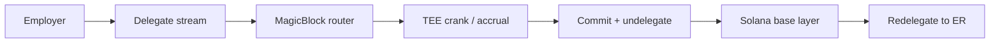
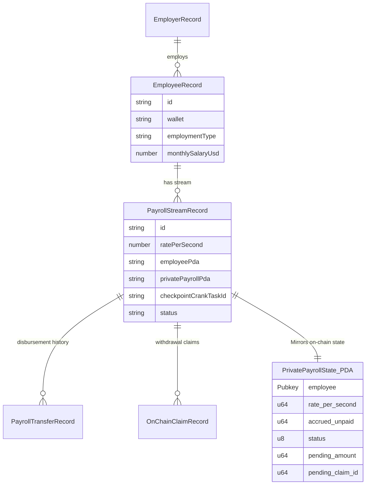
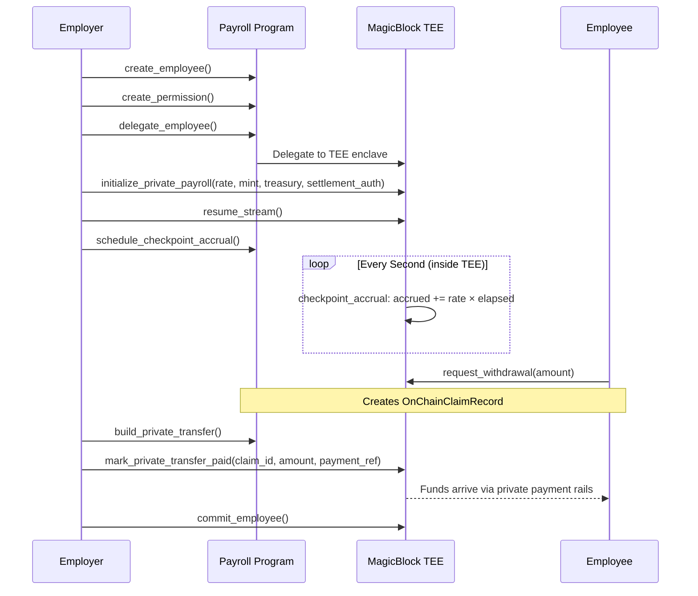

<div align="center">

# Expaynse

**Private Real-Time Payroll on Solana — Powered by MagicBlock TEE**

[Problem](#the-problem) • [Market](#market-opportunity) • [Competitors](#competitive-landscape) • [GTM](#go-to-market-strategy) • [Business Model](#business-model) • [Architecture](#architecture) • [MagicBlock](#magicblock-integration) • [Getting Started](#getting-started)

*Expaynse — Private, real-time payroll infrastructure on Solana.*

</div>

## Overview

Expaynse is a confidential, real-time salary streaming protocol on Solana. Employers fund a private treasury, add employees with per-second salary rates, and salaries accrue autonomously inside MagicBlock's Trusted Execution Environment (TEE). Employees can view their live earnings and withdraw — all without exposing compensation data to the public chain.

Expaynse uses MagicBlock as the real-time execution layer, specifically through Ephemeral Rollups, TEE execution, router-based scheduling, and delegated stream settlement.

MagicBlock is not a decorative dependency in Expaynse. It powers the real-time streaming path end-to-end:

1. The employer delegates an employee stream to a MagicBlock validator.
2. The payroll program schedules an autonomous crank on the MagicBlock router (`schedule_checkpoint_accrual`).
3. The TEE accrues salary per-second in the delegated execution environment without leaking state to base layer RPCs.
4. The stream is committed back to the Solana base layer when a settlement or mutation is needed.
5. The stream is redelegated so real-time payroll resumes seamlessly.



---

## The Problem

### Salary Transparency Destroys Companies From the Inside
On a public blockchain, every salary is visible. When employees discover compensation gaps — even justified ones — it breeds resentment and attrition.
- Employee A discovers Employee B earns 30% more. Morale collapses.
- Top performers leave when they learn junior hires negotiated higher.
- Private bonuses become public knowledge. Everyone expects one.
- Every raise is visible — compensation becomes office gossip.

### Outsiders Can Read Your Entire Payroll
- Competitors see your burn rate and poach talent by outbidding exact salaries.
- Investors reverse-engineer your runway from payment flows.
- Bad actors identify high earners and target them.
- Every payout creates a permanent employer-to-employee link on-chain.

### Workers Earn Every Second But Get Paid Every 30 Days
Traditional payroll forces a 30-day liquidity gap. Workers generate value from minute one but only access earnings weeks later. Cross-border teams wait 3–5 days for SWIFT settlements, losing 3–7% to fees and FX spreads.

---

## Market Opportunity

The on-chain payroll market is accelerating as crypto compensation goes mainstream.

**Why now:** By 2026, stablecoin payroll has crossed the early-adopter chasm. Regulatory clarity is improving, enterprise blockchain adoption is maturing, and Gen-Z workforce expectations are shifting toward real-time, crypto-native compensation. Yet no major protocol offers true salary privacy — until Expaynse.

| Segment | Size | Pain Point |
|---------|------|------------|
| **Crypto-native companies** | 50,000+ globally | Every salary is public on-chain, exposing org charts. |
| **Remote-first teams** | 70M+ workers | 3–7% cross-border fees, 3–5 day settlement waits. |
| **Freelancer platforms** | $1.5T gig economy | 30-day payment gaps, high platform lock-in. |
| **DAOs & treasuries** | $25B+ managed | No privacy tooling for contributor payments. |

---

## Competitive Landscape

Expaynse is the only protocol that combines TEE-private salary state, per-second streaming, and private settlement. Here is how we compare:

| Protocol | Streaming | Privacy | Settlement | Chain |
|----------|-----------|---------|------------|-------|
| **Superfluid / Sablier** | Per-second | None — all public | Public transfers | EVM |
| **Zebec** | Per-second | None — all public | TradFi integration | Solana |
| **Streamflow** | Per-second | None — all public | Public transfers | Solana |
| **Expaynse** | Per-second | TEE-private state | MagicBlock private payments | Solana |

- **Superfluid / Sablier:** Great streaming primitives, but all salary data is fully public on-chain. Any explorer can see who pays whom and how much. No privacy at all.
- **Zebec:** Closest in ambition (real payroll on Solana), but focuses on TradFi compliance. Salaries are still transparent on-chain, relying heavily on centralized infrastructure.
- **Expaynse:** The privacy-first payroll protocol. TEE means salary rates and balances are computationally isolated. Private payment rails mean even the employer-employee link is obscured. Nobody else does this on Solana.

---

## Go-to-Market Strategy

### Phase 1 — Web3 Startups & DAOs (Now)
- **Why first:** Treasuries are already on-chain, teams are crypto-native, immediate product-market fit.
- **Wedge:** "Your contributor salaries are public right now — competitors can see your entire org chart and burn rate."
- **Distribution:** Solana ecosystem partnerships, hackathon demos, developer content, DAO governance proposals.

### Phase 2 — Remote-First Companies (Next)
- **Why:** 70M+ global remote workers, cross-border payroll is painful.
- **Wedge:** "Pay your global team in seconds for <$0.01 per transaction — no SWIFT, no intermediaries."
- **Distribution:** HR/payroll platform integrations, stablecoin on-ramp partnerships.

### Phase 3 — Freelancer Platforms & Contractor Networks
- **Why:** Gig economy workers earn every second but get paid every 30 days.
- **Wedge:** "Real-time salary streaming — withdraw your earnings the moment you earn them."
- **Distribution:** Platform SDK, white-label integration for freelancer marketplaces.

### Growth Levers
- **Employee self-service UX** — Zero-config employee onboarding lowers adoption friction to near zero.
- **Privacy as a moat** — Once a company runs payroll through TEE-private streams, switching cost is high.
- **Treasury management** — Built-in deposit flows and private balance management keep CFOs engaged.

---

## Business Model

Expaynse generates revenue through protocol-level fees and premium SaaS services — no rent-seeking middlemen, just infrastructure that earns as it scales.

| Revenue Stream | Model |
|----------------|-------|
| **Streaming fee** | Basis points on accrued salary volume |
| **Settlement fee** | Per-withdrawal flat fee |
| **Enterprise tier** | Monthly SaaS for audit, compliance, and multi-sig support |
| **Auditor access** | Per-token compliance portal access fees |

### Unit Economics
- **Cost to serve:** Near-zero marginal cost — all heavy logic is on-chain (or in the Ephemeral Rollup), no off-chain servers to maintain beyond basic metadata (MongoDB).
- **Revenue scales with volume:** More businesses × more employees × more withdrawals = compounding protocol fees.
- **Retention Moat:** Once payroll runs through TEE-private streams, migration cost is exceptionally high.

**Why This Works:** Traditional payroll processors (ADP, Gusto, Deel) charge $6–$12 per employee per month. Expaynse's protocol fee model is 10–100× cheaper for the employer while generating sustainable revenue at scale. A single DAO with 50 contributors streaming $5K/month each = $250K monthly volume → $250–$1,250/month in protocol fees.

---

## Architecture

Expaynse uses a hybrid state model: On-chain Anchor programs handle permissions and state commitments, MagicBlock Ephemeral Rollups handle real-time accrual securely and privately, and a MongoDB backend indexes metadata for rapid UI rendering.

### High-Level System Architecture

```text
┌─────────────────────────────────────────────────────────────────┐
│                        FRONTEND (Next.js 16)                    │
│                                                                 │
│  ┌──────────────┐  ┌──────────────┐  ┌──────────────────────┐  │
│  │   Employer   │  │   Employee   │  │     Treasury         │  │
│  │  Dashboard   │  │    Portal    │  │   Management         │  │
│  └──────┬───────┘  └──────┬───────┘  └──────────┬───────────┘  │
│         │                 │                      │              │
│  ┌──────┴─────────────────┴──────────────────────┴───────────┐  │
│  │              Wallet Adapter (Phantom / Solflare)           │  │
│  └──────────────────────────┬────────────────────────────────┘  │
│                             │  Ed25519 Signed Requests          │
│  ┌──────────────────────────┴────────────────────────────────┐  │
│  │            Next.js API Routes (14 route groups)            │  │
│  │  /api/payroll · /api/employees · /api/streams · /api/auth  │  │
│  └──────────────────────────┬────────────────────────────────┘  │
└──────────────────────────────┼──────────────────────────────────┘
                               │
          ┌────────────────────┼────────────────────┐
          │            SOLANA DEVNET                 │
          │                                         │
          │  ┌───────────────▼──────────────────┐   │
          │  │     Payroll Program (Anchor)      │   │
          │  │     HoDcH6ocPxqHt5yEQ...         │   │
          │  │     18 instructions · Rust        │   │
          │  └──┬──────────┬───────────┬────────┘   │
          │     │          │           │             │
          │     ▼          ▼           ▼             │
          │  ┌────────┐ ┌────────┐ ┌──────────┐     │
          │  │MongoDB │ │MagicBl.│ │MagicBlock│     │
          │  │        │ │Payments│ │   TEE    │     │
          │  │metadata│ │  API   │ │(Ephemeral│     │
          │  │store   │ │private │ │ Rollups) │     │
          │  │        │ │transfer│ │          │     │
          │  └────────┘ └────────┘ └──────────┘     │
          │                                         │
          └─────────────────────────────────────────┘
```

### Hybrid State Model (ER Diagram)

Our backend maps robust off-chain schemas to minimal on-chain PDAs to maintain speed, queryability, and privacy.



### PDA Derivation Map

```
Employee        → ["employee", employer_pubkey, stream_id]
PrivatePayroll  → ["private_payroll", employee_pda]
Permission      → derived via permissionPdaFromAccount(employee_pda)
```

---

## MagicBlock Integration

Expaynse heavily leverages the `ephemeral-rollups-sdk` (v0.11) and `magicblock-magic-program-api` (v0.8.8) to deliver its privacy and real-time promises.

### Key Design: Keeper-Free Architecture
Unlike V1 streaming protocols that rely on off-chain keeper services to update balances, Expaynse is fully on-chain and autonomous:
- **Crank-based settlements** — The MagicBlock router schedules `checkpoint_accrual` autonomously via the `schedule_checkpoint_accrual` instruction.
- **No relayer needed** — Employees sign withdrawal requests directly against the TEE state (`request_withdrawal`).
- **Private treasury** — MagicBlock ephemeral vault holds funds with private balance visibility.

### 18-Instruction On-Chain API

| Instruction | Purpose |
|-------------|---------|
| `create_employee` | Deploy opaque PDA for employee on base layer |
| `initialize_private_payroll` | Create private state inside the ephemeral rollup |
| `pay_salary` | Settle accrued amount directly against private state |
| `checkpoint_accrual` | Tick accrued salary forward (crank-driven) |
| `request_withdrawal` | Employee-initiated claim from accrued balance (`OnChainClaimRecord`) |
| `mark_private_transfer_paid` | Settlement authority confirms off-chain payment |
| `cancel_pending_withdrawal` | Settlement authority cancels a pending claim |
| `update_private_terms` | Change rate while checkpointing accrued balance |
| `pause_stream` / `resume_stream` / `stop_stream` | Stream lifecycle control |
| `close_private_payroll` / `close_employee` | Clean up terminated streams and reclaim rent |
| `create_permission` | Grant TEE access control for employer + employee |
| `delegate_employee` | Move employee account into TEE validator |
| `commit_employee` / `undelegate_employee` | Sync state back to base layer |
| `schedule_checkpoint_accrual` | Register recurring crank via MagicBlock Magic Program |
| `cancel_checkpoint_accrual` | Cancel a scheduled crank task |

### Real-Time Streaming Flow



---

## Security Model

- **Wallet-based Authentication:** Every API request is authenticated via Ed25519 wallet signatures. The client signs a structured message (`wallet`, `method`, `path`, `timestamp`, `bodySha256`). The server verifies against the claimed wallet's public key to issue an HMAC session.
- **Company Key Vault:** Treasury and settlement authority keypairs are encrypted at rest using AES-256-GCM with a server-side encryption secret. Keys never leave the server in plaintext.
- **TEE Privacy Guarantees:** Private payroll state (rates, accrued balances, active claims) lives inside MagicBlock's TEE during active streaming. Only the employer authority and the linked employee wallet have permission-gated access.
- **Auditor Access:** Time-limited, revocable tokens grant read-only access to payroll data for compliance purposes without exposing the employer's signing authority.
- **Monthly Caps:** Configurable per-employee `monthlyCapState` prevents overpayment and drains.

---

## AI Model Routing

Expaynse now includes a server-side Gemini routing layer for Q&A and vectorization:

- `POST /api/ai/answer` uses model routing with retries:
  - `mode: \"fast\"` -> `GEMINI_FAST_MODEL` -> `GEMINI_DEFAULT_ANSWER_MODEL` -> `GEMINI_QUALITY_FALLBACK_MODEL`
  - `mode: \"default\"` -> `GEMINI_DEFAULT_ANSWER_MODEL` -> `GEMINI_QUALITY_FALLBACK_MODEL` -> `GEMINI_FAST_MODEL`
  - `mode: \"quality\"` -> `GEMINI_QUALITY_FALLBACK_MODEL` -> `GEMINI_DEFAULT_ANSWER_MODEL` -> `GEMINI_FAST_MODEL`
- `POST /api/ai/embed` uses `GEMINI_EMBED_MODEL` for embeddings.
- Both routes require wallet authorization headers/session, same as the rest of the API.

Set these environment variables in `.env`:

```bash
GEMINI_API_KEY=...
GEMINI_FAST_MODEL=models/gemini-3.1-flash-lite
GEMINI_DEFAULT_ANSWER_MODEL=models/gemini-2.5-flash
GEMINI_QUALITY_FALLBACK_MODEL=models/gemini-2.5-pro
GEMINI_EMBED_MODEL=models/gemini-embedding-2
```

---

## Getting Started

### Prerequisites
- Node.js 18+
- Solana CLI with a devnet wallet
- Anchor CLI 0.32.1
- MongoDB (Atlas or local)

### 1. Install Dependencies
```bash
git clone https://github.com/shumhn/expaynse.git
cd expaynse
npm install
```

### 2. Configure Environment
```bash
cp .env.example .env
```
Fill in the required values (MongoDB URI, Anchor Wallet, MagicBlock RPCs).

### 3. Build & Test
```bash
# Build the Anchor program
npm run payroll:build

# Run Anchor tests against devnet
npm run payroll:test

# Verify MagicBlock Connectivity
npm run payroll:magicblock:health

# Full payroll lifecycle E2E (onboard → accrue → disburse → claim)
npm run test:app:e2e
```

### 4. Run Frontend
```bash
npm run dev
```
Open `http://localhost:3000` to access the dashboard.

---

## Roadmap

| Phase | Status | Milestone |
|-------|--------|-----------|
| V1 — Core streaming | Done | Per-second salary accrual, employer dashboard, employee portal |
| V2 — MagicBlock TEE | Done | Delegated execution, private state, checkpoint cranks (`schedule_checkpoint_accrual`) |
| V3 — Private settlements | Done | MagicBlock private payments and treasury funding |
| V4 — Production hardening | In progress | Monthly caps, batch disbursement, compliance, audit portal (`OnChainClaimRecord`) |
| V5 — Multi-company | Planned | Multi-tenant vault, company isolation, role-based access |
| V6 — Mainnet | Planned | Mainnet deployment, fee model activation, enterprise tier |

---

<div align="center">

**Built for the [Colosseum Hackathon](https://www.colosseum.org/) 🏛️**

*Privacy is not a feature — it's a right.*

</div>
